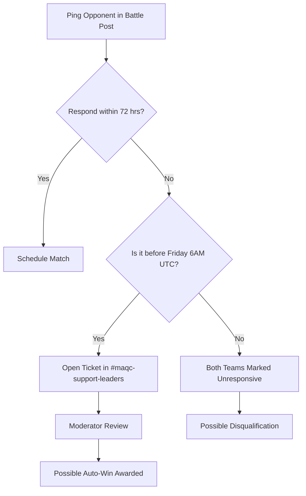
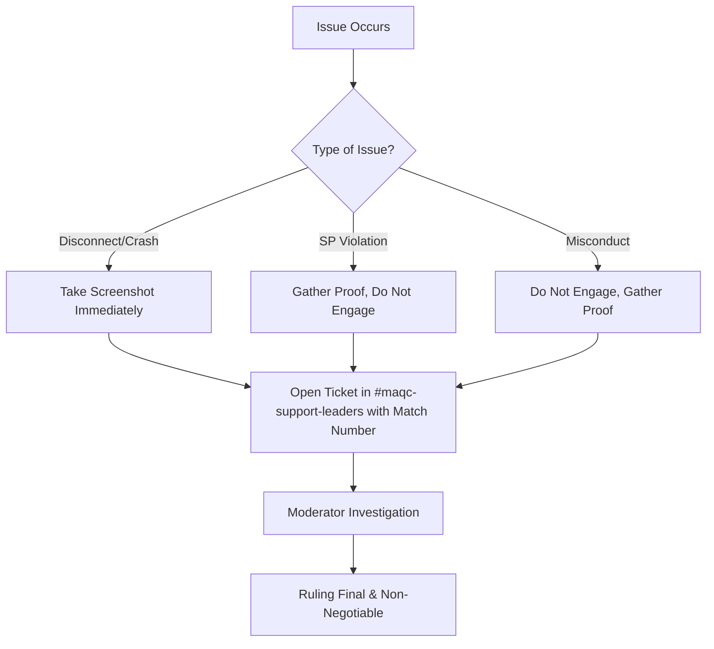

# Mech Arena Quarterly Clash (MAQC) Season 7 Knowledge Base

**Version**: 1.2
**Last Updated**: 24 September 2026 (Week 6 #630 Ticket #267 gross misconduct precedent added)

**Source Documents**: 
- `Mech Arena Quarterly Clash - Information Guide.pdf` (Version 1.0, Issued 26 July 2026)
- `discord text shared by admins.txt` (Season 7 Discord Announcements & Official Rulebook)
- `Official Rulebook` (Latest updates submitted by user)
- `Honor System Clarification Announcement` (Discord Announcement, August 17, 2026)
- `Week 1 Official Announcement & Match Guides` (Discord Announcement, August 17, 2026)

## Purpose
This document serves as the single, comprehensive, and canonical repository for all rules, workflows, and procedures regarding MAQC Season 7. It transforms all official documentation into an optimized format for AI reasoning, retrieval, and Semantic Search. 

## Scope
This knowledge base covers all aspects of MAQC Season 7, including tournament structure, registration, battle procedures, SP regulations, moderator protocols, honor systems, and the 5,000,000 A-Coins reward system.

## AI Usage Instructions
*See the end of this document for strict instructions on how AI should process and retrieve this information.*

## Table of Contents
- [Project Overview](#project-overview)
- [Important Dates & Timeline](#important-dates--timeline)
- [Announcements](#announcements)
- [Glossary, Definitions & Terminology](#glossary-definitions--terminology)
- [Roles](#roles)
- [Workflows](#workflows)
- [Decision Trees](#decision-trees)
- [Tournament Structure & Registration Rules](#tournament-structure--registration-rules)
- [Matchmaking & Weekly Flow](#matchmaking--weekly-flow)
- [Battle Procedure & Scheduling Rules](#battle-procedure--scheduling-rules)
- [Communication & Forum Usage](#communication--forum-usage)
- [Submissions & Evidence Requirements](#submissions--evidence-requirements)
- [SP Rules, Bracket System & Violations](#sp-rules-bracket-system--violations)
- [Disputes, Moderator Procedures & Appeals](#disputes-moderator-procedures--appeals)
- [Honour System, Penalties & Reward System](#honour-system-penalties--reward-system)
- [Quick Reference Tables](#quick-reference-tables)
- [Frequently Asked Questions (FAQ)](#frequently-asked-questions-faq)
- [AI Usage Instructions](#ai-instructions)

---

## Project Overview

**Mech Arena Quarterly Clash (MAQC)** is an officially sanctioned, multi-weeklong event that tests the skills of players while rewarding strong performances. MAQC promotes healthy competition between members of the server while giving back to the community. Season 7 coincides with the monumental **5th Anniversary of Mech Arena**, featuring a record-shattering **5,000,000 A-Coins** prize pool.

### New in Season 7
- **6 Weeks of Play**: Extended from previous seasons.
- **Best of 3 (Bo3)**: Matches are Bo3 to ensure victories rely on skill.
- **10 Matchmaking Brackets**: Expanded for granular distribution based on SP.
- **Reworked Dispute System**: Faster, clearer, and fairer rulings.
- **Scale**: 1,306 teams and 4,921 players registered. The biggest MAQC in history.

---

## Important Dates & Timeline

| Event | Date / Deadline | Notes |
| :--- | :--- | :--- |
| **Registrations Open** | 3rd August 2026 | - |
| **Initial Registration Closes** | 15th August 2026, 6:00 AM UTC | Roster changes with no penalty must occur before this. |
| **Extended Registration Period** | 17th August to 23rd August, 6:00 AM UTC | Final call. Teams registered here forfeit Week-1 rewards. |
| **Week-1 Start** | 17th August 2026, 6:00 AM UTC | - |
| **Week-1 End / Deadline** | 23rd August 2026, 6:00 AM UTC | All matches must be played and submitted before this. |
| **Weekly Match List Release** | Every Monday | Sent out via Discord. |
| **Weekly Moderator / Scheduling Deadline** | Every Friday, 6:00 AM UTC | All leaders must agree on a time before this. Mods will not accept scheduling requests after this point. |
| **Weekly Match Submission** | Every Sunday, 6:00 AM UTC | Matches must be completed and submitted. |

> [!WARNING]
> Registering after the Initial Registration Deadline (August 15th) completely voids Week-1 results. Re-registering due to errors also yields a Week-1 auto-loss.

---

## Announcements

- **Prize Pool Announcement:** Plarium stepped up with 5,000,000 A-Coins for the 5th Anniversary.
- **Registration Bot Fix:** A bug with the Discord verification bot was fixed shortly after launch. Teams affected were advised to proceed or open support tickets.
- **Honor System Clarification (August 17, 2026):** Clarified that matches must proceed regardless of active disputes, and outlined SP adjustments for penalized teams.
- **Week 1 Begins (August 17, 2026):** Week 1 officially started. 1,306 teams and 4,921 pilots are competing. Week 1 map is **Biogear Lab**. Format is Bo3 CPC.

---

## Glossary, Definitions & Terminology

- **MAQC**: Mech Arena Quarterly Clash.
- **Max SP**: The highest possible Squad Power achievable using fully equipped mechs, weapons, pilots, implants, and mods (all 5 mechs equipped).
- **Bracket**: One of the 10 matchmaking tiers teams are sorted into based on their registered SP.
- **Captain / Team Leader**: The sole team representative responsible for registration, communication, and disputes.
- **Battle Post / Channel**: The assigned Forum post where teams must communicate, schedule matches, and post results.
- **Extended Registration**: A grace period (Aug 17-23) allowing late registrations or re-registrations at the cost of Week-1 rewards.
- **Auto Win / Auto Loss**: Automatic match outcomes awarded by moderators due to rule violations, absences, or penalties.
- **Demerit**: A penalty point in the Honour System that applies a -25% reward deduction.
- **Compensation**: A reward bonus in the Honour System that adds +10% final rewards to the affected team.
- **Weight / Weightage**: The scaling factor of a win in an SP bracket that determines a team's share of the final prize pool.
- **Equalize**: The mandatory custom lobby bot setting for all MAQC matches.
- **Fill**: An alternative bot setting — NOT the official MAQC setting. The correct setting is Equalize.
- **Bo3**: Best of 3. First team to win 2 matches wins the series.
- **CPC**: Control Point Clash. The designated gamemode for all MAQC matches.
- **Custom Match Code**: The in-game code generated by the lobby host that the opposing team uses to join the match.
- **Match Number**: The unique identifier assigned to each team's weekly matchup, found in the MM list.
- **MM List**: Matchmaking List — the official list of all match pairings for the week.
- **Battle Post**: The assigned thread in #s07-battle-posts-week-01 corresponding to a specific match number.

---

## Roles

- **Player / Teammate**: Participates in the match. Must have a registered Mech Arena Player ID.
- **Captain (Team Leader)**: Must join the MAO Discord, hold the `MAQC-S07-Leader` role, register the team, communicate with opponents, and handle disputes.
- **MAQC Moderator**: Staff who handle standard disputes, assign fixed times, and enforce rules.
- **Senior MAQC Moderator**: Staff who handle escalations, severe infractions, and final non-negotiable decisions.

---

## Workflows

### Registration Workflow
1. Leader navigates to MAQC registration site.
2. Leader inputs Email and Mech Arena Player ID (used as password).
3. Leader inputs Max SP and team size (3-5 players).
4. Leader inputs Player IDs for the entire roster.
5. Leader completes Mandatory Discord Verification to receive `MAQC-S07-Leader` role.
6. Leader reads rules, checks agreement, and clicks "Register team".
7. System generates profile showing roster, bracket, and match history.

### How to Find Your Opponent (Weekly)
1. Go to [#s07-mm-list](https://discord.com/channels/542314937624690688/1532790795541811375) and look up your team name to find your **Match Number** and opponent.
2. Alternatively, check the [MAQC Website](https://maqc.mecharenadev.com/) under your team profile.
3. Once you have your Match Number, go to [#s07-battle-posts-week-01](https://discord.com/channels/542314937624690688/1530987549848375306) and search for your Match Number to find your Battle Post.
4. Ping your opponent in that Battle Post to start coordinating.

### Match Workflow
1. Monday: Match list released. Team Leader checks `#s07-mm-list` and finds assigned Battle Post.
2. Monday–Thursday: Captains ping each other in the Battle Post to agree on a time. Time must be agreed before **Friday 6:00 AM UTC**.
3. One leader creates the Custom Match and shares the **Custom Match Code** in the Battle Post.
4. Both teams join. Lobby bot set to **"Equalize"**. Play Best of 3 CPC on Biogear Lab (Week 1).
5. If the opponent is not present within **10 minutes** of agreed time, ping a MAQC Moderator in the Battle Post.
6. Post-Match: Winner posts screenshots of result screens for each match played in the Battle Post.
7. Submission deadline: **Sunday 6:00 AM UTC**.

### Dispute Workflow (AFK / Scheduling)
1. Captain pings opponent in Battle Post.
2. If opponent does not respond:
   - **Less than 72 hours**: Keep trying in the Battle Post.
   - **More than 72 hours**: Open a ticket (Scheduling Issue) in [#maqc-support-leaders](https://discord.com/channels/542314937624690688/1533319063185522800).
3. If teams cannot agree on a time before Friday 6:00 AM UTC, ping an active MAQC Moderator to help set a fixed time.
4. After Friday 6:00 AM UTC, mods will not accept scheduling requests.

---

## Decision Trees

### Opponent Unresponsive (AFK) Decision Tree

### Dispute Resolution Decision Tree

---

## Tournament Structure & Registration Rules

### Rule Name: Roster Size & Exclusivity
#### Source
Information Guide PDF (Page 2), Discord Rulebook (Section 1 & 2)
#### Summary
Teams must have exactly 3 to 5 players with no substitutes, and players can only be on one roster.
#### Full Rule
A valid team requires one chosen leader and a total of 3 to 5 members (including the leader). No substitutes are allowed. A player may participate on only one team. If a player is found registered on multiple teams, all teams involved will be disqualified.
#### Applies To
All Teams and Players.
#### Requirements
3-5 unique Player IDs.
#### Exceptions
None.
#### Violations
Duplicate team submissions or a single player registered on multiple teams.
#### Penalty
Immediate disqualification without warning for all teams involved.

### Rule Name: Mid-Season Player Removal
#### Source
Mod ruling — night fury (`<@934544234000830525>`), MAQC Support ticket **#583**, Sun 20 Sep 2026, 4:15 PM IST (verbatim reply).
#### Summary
Leaders may remove players mid-season, anytime. No penalty, but the team's SP can be recalculated if the removed player was the highest SP. A team cannot drop below 2 players. Removing before the week's matchmaking yields an even pairing (4v4 / 3v3); removing during the week leaves an uneven pair.
#### Full Ruling (verbatim)
1. Yes. They can be removed anytime.
Before week 6: 4v4 or 3v3
During week 6: Uneven pair

2. No penalty, but your SP can be recalculated if the person you removed was the highest SP

3. Yes, you just cant drop to below 2

4. It can

(Q4 = "does removing a player change our Registered SP / Bracket 10 for matchmaking?" → "It can.")
#### Applies To
Team leaders managing rosters during the season.
#### Penalty
None for the removal itself; SP recalculation possible as above.
#### Execution Precedent (Sun 20 Sep 2026, night, ticket #583)
When the captain reported the decision ("counting them both out"), night fury asked for the two
in-game IDs and **performed the removals himself** ("Removed and updated your max SP") — leaders
do not need to execute the removal in-game; giving the mod the IDs is sufficient. The mod also
**updated the team's max SP** after removal (confirming the Q4 recalc "It can" does happen). He
added it "doesnt really matter atp" — implying SP no longer materially affects this team's W6
standings (casual remark, not a formal ruling).
#### Resolution Addendum (Sun 20 Sep 2026, night, same ticket — full transcript in `Week_5_Mod_Questions.md`)
- SP recalc DID happen: mod first set 20,723, captain flagged it (teammate's figure: 22,700) with a
  screenshot, mod raised it → **team max SP confirmed 22,700** (was 23,000 at registration).
- **mikeyyy_007 = night fury's Discord username** — one person, not a separate mod.
- **How mods read SP: manually** — "basically the max sp in the person's hangar at the time we check."
  (Automation suggestion relayed to the mod; previously discussed with "stain".)

### Rule Name: Captain Discord Requirement
#### Source
Information Guide PDF (Page 7 & 11), Discord Rulebook (Section 2)
#### Summary
The team captain must be in the MAO Discord to register and manage the team.
#### Full Rule
The chosen leader who makes the registration MUST be in the MAO Discord. During registration, Discord verification is mandatory. The captain must authorize the bot, join the Mech Arena Official server, and receive the `MAQC-S07-Leader` role.
#### Applies To
Team Captains.
#### Exceptions
Teammates do not need to join the Discord.
#### Penalty
Incomplete registration (team removed from Week-1 matchmaking).

### Rule Name: Extended & Re-Registration
#### Source
Information Guide PDF (Page 2), Discord Rulebook (Section 1 & 3)
#### Summary
Late registrations or correcting invalid Week-1 registrations is allowed until the extended deadline, but penalizes the team.
#### Full Rule
After the initial deadline (August 15th), an Extended Registration opens until August 23rd. Teams missing from Week-1 due to registration errors may re-register here. 
#### Penalty
Teams registering or re-registering during this period will receive an automatic loss (auto-loss) for Week-1 and forfeit Week-1 rewards.

---

## Matchmaking & Weekly Flow

### Rule Name: Weekly SP Updates
#### Source
Information Guide PDF (Page 4 & 12), Discord Rulebook (Section 2)
#### Summary
Captains can increase their team's Max SP once per week.
#### Full Rule
After the deadline of a match week (Sunday), team leaders have a one-time opportunity during the edit window to update their registered SP to align with their current status.
#### Requirements
SP can ONLY be increased, never reduced.

---

## Battle Procedure & Scheduling Rules

### Rule Name: Match Format & Setup
#### Source
Information Guide PDF (Page 3), Discord Rulebook (Section 3), Week 1 Announcement
#### Summary
All matches are Best of 3 CPC battles. Week 1 map is Biogear Lab. Lobby bots must be set to Equalize.
#### Full Rule
Every week, teams complete 1 match consisting of a Best of 3. First to 2 victories wins the series. If a team wins the first 2 matches, the 3rd match does not need to be played. All matches in the series are played on the same designated map for that week.
- **Week 1 Map:** Biogear Lab
- **Gamemode:** CPC (Control Point Clash)
- **Lobby Bot Setting:** Must be set to **"Equalize"**. Not following this may lead to a dispute.
#### Requirements
Lobby option must be set to "Equalize". Wrong map = potential dispute and match invalidation.
#### Violations
Playing on the wrong map or using unregistered Player IDs.
#### Penalty
Immediate, non-negotiable removal from the tournament. Wrongly-mapped match may be invalidated.

### Rule Name: Bot Absence Rule
#### Source
Week 1 Bot Rules Announcement
#### Summary
Absent players must be replaced with in-game bots. Lobby must be set to Equalize.
#### Full Rule
If a player is absent, they must be substituted with an in-game bot. The Match Lobby bot option must be set to **"Equalize"**. If unsure, confirm with the opposing leader or ping a Moderator before starting the match.

### Rule Name: Disconnections & Crashes
#### Source
Discord Rulebook (Section 3)
#### Summary
Matches do not stop for crashes.
#### Full Rule
The match will not stop for disconnections or crashes. For critical issues, affected players must take a screenshot immediately and report it to tournament moderators with proof via ticket in [#maqc-support-leaders](https://discord.com/channels/542314937624690688/1533319063185522800).

### Rule Name: Match Scheduling & No-Response Protocol
#### Source
Information Guide PDF (Page 3 & 4), Discord Rulebook (Section 4), Week 1 Scheduling Guide
#### Summary
Captains must schedule via Battle Post before Friday 6:00 AM UTC.
#### Full Rule
Captains must ping their opponents in the Battle Post to agree on a time. All leaders must set a specific battle time before **Friday 6:00 AM UTC**. After this deadline mods will not accept requests to set battle times. If the opponent is not responding:
- Less than 72 hours: Keep trying in the Battle Post.
- More than 72 hours: Open a ticket (Scheduling Issue) in [#maqc-support-leaders](https://discord.com/channels/542314937624690688/1533319063185522800).
#### Violations
Mutual unresponsiveness (neither team raises a dispute).
#### Penalty
Both teams may be disqualified. Unresponsive opponent yields an Auto-Win for the active team.

### Rule Name: Fixed Match Times & 10-Minute Wait
#### Source
Discord Rulebook (Section 4), Week 1 Scheduling Guide
#### Summary
Moderators set a fixed time if teams cannot agree. Teams must wait 10 minutes.
#### Full Rule
If scheduling is impossible, contact a MAQC Moderator before Friday 6:00 AM UTC. Once a time is agreed or set by mods, one leader creates the Custom Match and shares the Custom Match Code in the Battle Post. Teams must wait 10 minutes. If the opponent doesn't join, ping a MAQC Moderator in the Battle Post immediately.
#### Penalty
Immediate forfeit (auto-loss) for the no-show team.

### Rule Name: Match Result Submission
#### Source
Week 1 Result Submission Guide
#### Summary
A screenshot of the result screen is required for each match played. Post in Battle Post.
#### Full Rule
- A screenshot of the result screen is required for each match played in the series.
- Post the screenshot(s) directly in your Battle Post in [#s07-battle-posts-week-01](https://discord.com/channels/542314937624690688/1530987549848375306).
- If there is a dispute about the result, do not try to resolve it yourselves. Open a ticket in [#maqc-support-leaders](https://discord.com/channels/542314937624690688/1533319063185522800) with your Match Number and issue description.
- The series ends once a team reaches 2 wins. If that happens after 2 matches, you do not need to play or submit a 3rd screenshot.

---

## Communication & Forum Usage

### Rule Name: Official Communication Channel
#### Source
Information Guide PDF (Page 3 & 4), Discord Rulebook (Section 4 & 8), Week 1 Announcement
#### Summary
All MAQC-related discussion must happen in the assigned Battle Post. DMs and external platforms are not valid for disputes.
#### Full Rule
All communication about a match must happen in [#s07-battle-posts-week-01](https://discord.com/channels/542314937624690688/1530987549848375306). Conversations held elsewhere (DMs, external servers) will not be accepted as evidence in a dispute.

### Rule Name: Self-Conduct
#### Source
Information Guide PDF (Page 6), Discord Rulebook (Section 5)
#### Summary
Zero tolerance for toxic behavior.
#### Full Rule
Participants must show good sportsmanship. Harassment, toxicity, disrespect, instigating, abusing loopholes, or deliberate disruption is prohibited. Entire team is liable for any member's actions.
#### Violations
Any form of misconduct.
#### Penalty
Warnings, team disqualification, or blacklisting from future MAQC seasons.

---

## Submissions & Evidence Requirements

### Rule Name: Match Submissions
#### Source
Information Guide PDF (Page 4), Discord Rulebook (Section 8), Week 1 Submission Guide
#### Summary
Screenshots must be posted before Sunday deadline. Late submissions or incomplete reports are ignored.
#### Full Rule
Team leaders must post clear and unedited screenshots of battle result screens in the Battle Post for each match played in the series. 
#### Requirements
Must be posted before the weekly Sunday 6:00 AM UTC deadline.
#### Violations
Failure to post, posting late, or modifying/misrepresenting results.
#### Penalty
Failure/Late = Auto-lose for both teams. Misrepresenting = severe penalties (immediate disqualification).

---

## SP Rules, Bracket System & Violations

### Rule Name: Max SP Definition
#### Source
Information Guide PDF (Page 9), Discord Rulebook (Section 6)
#### Summary
Max SP is the absolute highest achievable squad power.
#### Full Rule
"Max SP" refers strictly to the highest possible Squad Power achievable using fully equipped mechs, weapons, pilots, implants, and mods with all 5 mechs equipped in the hangar.
#### Violations
Misreporting SP or manipulating hangars.
#### Penalty
Immediate disqualification with no appeal.

### Rule Name: SP Tolerances
#### Source
Information Guide PDF (Page 13), Discord Rulebook (Section 6)
#### Notes
> [!IMPORTANT]
> **Documentation Conflict:** The *Information Guide* states two exact tolerances: 10% above registered SP and 5% above Bracket SP. The *Official Rulebook* states the tolerance margin is undisclosed.

#### Violations
Exceeding the SP bracket during a match.
#### Penalty
Disqualification from the match week, auto-loss, moved up to an appropriate bracket. No appeals accepted.

---

## Disputes, Moderator Procedures & Appeals

### Rule Name: Filing a Dispute & Ongoing Matches
#### Source
Honor System Clarification Announcement (August 17, 2026)
#### Summary
Disputes do not pause matches. Both teams must still play.
#### Full Rule
Matches must proceed regardless of the status of any open dispute. Both teams are still required to schedule and complete their weekly match.

> [!IMPORTANT]
> Open tickets for disputes in [#maqc-support-leaders](https://discord.com/channels/542314937624690688/1533319063185522800) and include your **Match Number** and the issue.

---

## Honour System, Penalties & Reward System

### Rule Name: Demerits & Honour System
#### Source
Information Guide PDF (Page 14), Discord Rulebook (Section 6), Honor System Clarification (August 17, 2026)
#### Full Rule
- **Demerit:** -25% final rewards for offending team.
- **Compensation:** +10% final rewards for affected team.
- **Post-Dispute SP Adjustment:** Teams penalized for exceeding SP bracket must adjust hangars to play within +5% tolerance for that week.
- **Opposing Team Responsibility:** Opponents are responsible for enforcing that the penalized team stays within tolerance.
- Demerits stack.
#### Penalties
- 1 Demerit: -25% (victim +10%)
- 2 Demerits: -50% total
- 3 Demerits: -75% total
- 4 Demerits: Disqualification

### Rule Name: Reward Calculation (Linear Model)
#### Source
Official Rulebook (Section 7)
#### Full Rule
- More wins = higher rewards.
- Higher SP brackets = larger rewards.
- No consolation or participation rewards. Teams with zero wins receive no rewards.

---

## Moderator Authority

### Rule Name: Moderator Authority
#### Source
Discord Rulebook (Section 8)
#### Full Rule
Once moderators intervene, their ruling is final and non-negotiable. Non-compliance results in immediate forfeits or disqualification. No appeals accepted.

---

## Key Discord Channel Index

| Channel | Purpose |
| :--- | :--- |
| [#s07-mm-list](https://discord.com/channels/542314937624690688/1532790795541811375) | Find your Match Number and opponent |
| [#s07-battle-posts-week-01](https://discord.com/channels/542314937624690688/1530987549848375306) | Post scheduling, match results, and disputes |
| [#maqc-support-leaders](https://discord.com/channels/542314937624690688/1533319063185522800) | Open support tickets (Scheduling, Disputes, Issues) |
| [MAQC Website](https://maqc.mecharenadev.com/) | View bracket, match details, verify completed matches |

---

## Quick Reference Tables

### Deadlines
| Action | Deadline Time (UTC) |
| :--- | :--- |
| Initial Registration | 15th August, 6:00 AM |
| Extended Registration | 23rd August, 6:00 AM |
| Week 1 End | 23rd August, 6:00 AM |
| Scheduling Agreement (all weeks) | Friday, 6:00 AM of match week |
| Match Results Submission | Sunday, 6:00 AM of match week |
| **Week 5 scheduling lock** | **Friday 18th September, 6:00 AM** (`<t:1789711200:F>`) |
| **Week 5 play + submit** | **Sunday 20th September, 6:00 AM** (`<t:1789884000:F>`) |
| **Week 6 ticket deadline (LAST of season)** | **Friday 25th September, 6:00 AM** (`<t:1790316000:F>`) |
| **Week 6 match + results deadline = season end** | **Sunday 27th September, 6:00 AM** (`<t:1790488800:F>`) |
| Missing Reward Report | Post-tournament deadline (TBA) |

### Week 6 announcement rules (official announcement, 21 Sep 2026 — reconfirms standing rules for the final week)
- Ticket deadline **Fri 25 Sep 6:00 AM UTC** (`<t:1790316000:F>`) — "the last ticket deadline of the
  season and there is nothing after it. Miss it and it's between you and your opponent, or a loss for both."
- Match deadline **Sun 27 Sep 6:00 AM UTC** (`<t:1790488800:F>`) — "Nothing in the battle post at 06:00
  means a loss for both teams. The season ends on time whether you played or not."
- One specific time agreed by both leaders **in the forum post**; rescheduling needs **≥6 hours** notice
  before the original time; opponent missing at the agreed time → **wait 10 minutes, then ping an active
  mod in the battle post**; no response after **72 hours** → ticket in #maqc-support-leaders; can't land
  on a time → ticket under **Scheduling Issue**.
- "Wrong map means a dispute and a match that will not count. Lobby bots on **Equalize**. Check twice, launch once."
- After Week 6, **results are final** and A-Coins get paid out (5,000,000 prize pool).
- Week 6 announcement cited 1,467 teams signed up at season start (announcement figure; KB overview's
  1,306 teams registered is the later registration figure).

### Binding precedents from our season (mod rulings observed in battle posts)
- **Week 2 #671 double-loss (mod night fury):** no time was ever "agreed" because one side gave a
  **range** (4:00–5:00 PM UTC) and the other side picked part of it unilaterally. BOTH teams got a
  loss. Standing rule: a valid lock = **ONE exact UTC time + explicit "yes" from BOTH leaders
  in the battle post. No ranges, no unilateral picks.
- **Week 2 #671 live ruling (mod night fury):** *"Both teams enter the game now and play. Whoever is
  available plays and you equalize teams."* Basis for the min-players/bots question in Week 5.
- **Week 6 #630 gross misconduct & DM threats disqualification (mod night fury, Ticket #267, 24 Sep 2026):**
  Opponent leader charliebrown0002 sent hostile DMs containing aggressive physical threats, abusive profanity, and physical confrontation challenges, while refusing cooperation in the battle post. Mod night fury ruled:
  *"Your team is being disqualified from this season for gross misconduct from your end. These screenshots show severe violations of the tournament's Code of Conduct as well as the server's. Your behaviour includes sending DMs containing aggressive physical threats, profanity, inappropriate comments and threats of violence. Any such offenses in the future could result in a permanent ban from the server depending on its severity. @Akulmach74 As a result, your team has to play bot matches with the equalize teams option selected."*
  Standing precedent: Severe DM harassment / violent threats lead to immediate season disqualification of the offending team; victim team is awarded a bot match (Equalize setting) on the scheduled map.
- **Bot-setting doc conflict (unresolved, ask mod):** Info Guide p.3 allows "Fill with bots" OR
  "Equalize with bots" if both sides agree; Week 1 bot-rules announcement mandates **Equalize**.
  Default to Equalize until a mod confirms otherwise.

### Week-by-Week Map (Known)
| Week | Map | Gamemode |
| :--- | :--- | :--- |
| Week 1 | Biogear Lab | CPC (Control Point Clash) |
| Week 2 | Skyship 11 | CPC (Control Point Clash) |
| Week 3 | Paradise Plaza | CPC (Control Point Clash) |
| Week 4 | Site 313 | Bo3 (CPC per season format) |
| Week 5 | Forbidden City (665 matches · 17 bot matches) | CPC (TBC with mod) |
| Week 6 (final) | **Imperial Temple** (official Week 6 announcement, 21 Sep 2026) | CPC — Bo3 |

### SP Tolerances
| Tolerance Type | Formula / Margin |
| :--- | :--- |
| Registered SP Tolerance | Current SP ≤ Registered SP × 1.10 |
| Bracket SP Tolerance | Current SP ≤ Bracket SP × 1.05 |

### Moderator Roster
*Senior MAQC Moderators (Escalations & Final Decisions):*
<@1118460031285862440>, <@574507294985814029>, <@418752049572741129>, <@828626630020431892>, <@508385209872285697>

*MAQC Moderators (General Issues):*
<@1087058967575924898>, <@1113385070972112946>, <@934544234000830525>, <@1362677437766303777>, <@1027763087488581662>, <@938102546575286373>, <@458219892227833856>, <@1092097683684065350>, <@790879437520240680>, <@802777038746419211>

---

## Frequently Asked Questions (FAQ)

**Q: Can I use a substitute player if my teammate is absent?**
A: No. Substitutes are not allowed. Absent players must be replaced with in-game bots (lobby set to Equalize).

**Q: Can a team remove a player mid-season?**
A: Yes — leaders can remove players anytime (night fury, Ticket #583, 20 Sep 2026). No penalty, but SP can be recalculated if the removed player was the highest SP; a team cannot drop below 2. Remove before the week's MM list for an even pairing (4v4 / 3v3); removing during the week = uneven pair.

**Q: What happens if my game crashes during a match?**
A: The match will not stop. Take a screenshot immediately and open a ticket in #maqc-support-leaders.

**Q: Can I lower my SP to get an easier bracket?**
A: No. Intentional SP manipulation results in immediate disqualification.

**Q: My opponent agreed in DMs but didn't show up. What do I do?**
A: DM agreements are not recognized. All scheduling must occur in the assigned Battle Post.

**Q: What happens if we register during the Extended Registration period?**
A: Your team receives an auto-loss for Week 1 and forfeits Week 1 rewards.

**Q: How are rewards calculated?**
A: Linear model — more wins and higher SP brackets = more A-Coins. Teams with 0 wins get no rewards.

**Q: What is the Week 1 map?**
A: Biogear Lab. Gamemode: CPC. Playing on the wrong map may result in a dispute and match invalidation.

**Q: What bot setting do I use in the lobby?**
A: Equalize. This is mandatory. Confirm with the opposing leader before starting if unsure.

**Q: Do I need to play Game 3 if we win the first two?**
A: No. If a team wins the first 2 matches, the 3rd does not need to be played or submitted.

**Q: What if a rule is not documented here?**
A: The official documentation does not specify this. Ping a MAQC Moderator for clarification.

---

## AI Usage Instructions

This knowledge base is intended to be attached to future AI conversations.
The AI should:
- **Answer only using this document whenever possible.**
- **Never invent rules, assumptions, or deadlines.**
- **Prefer official wording** from this document when citing rules.
- **Mention when documentation is incomplete** by stating "The official documentation does not specify this."
- **Distinguish between documented facts and inference.**
- **Treat this markdown as the canonical project documentation.**
